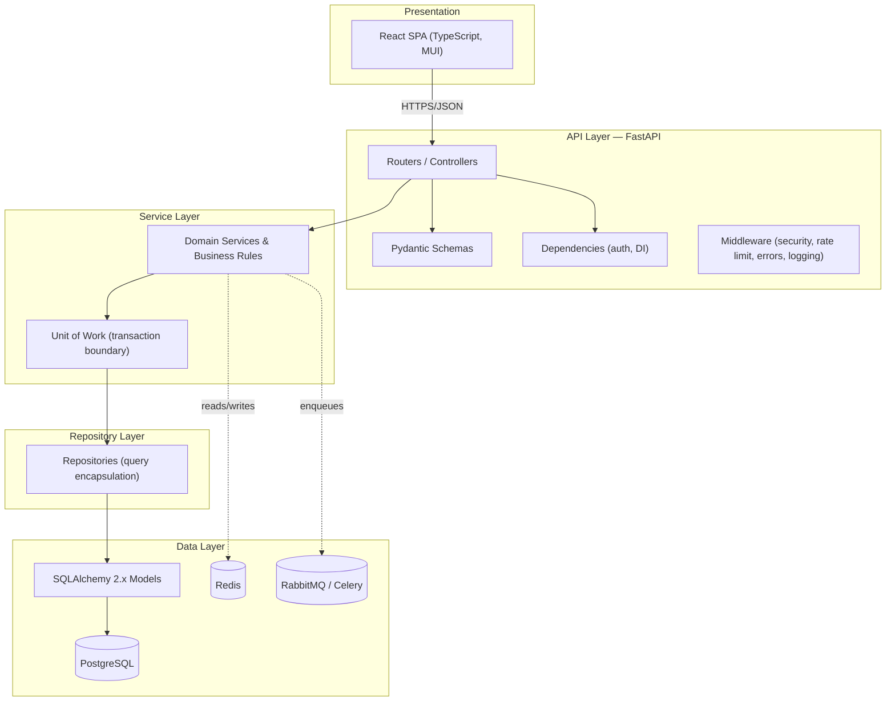
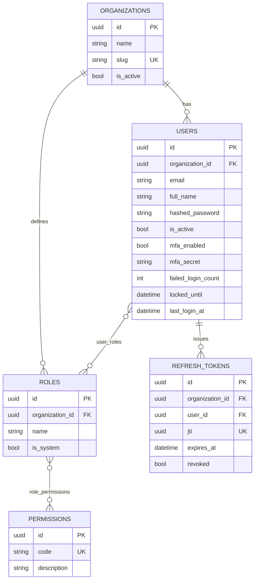

# ETIP — Architecture

**Enterprise Transformation Intelligence Platform**
*Plan. Execute. Govern. Transform.*

This document defines the system architecture, the major design decisions, and
the cross-cutting strategies (logging, caching, deployment, versioning, etc.)
that every module must follow.

---

## 1. Architectural style

### 1.1 Layered clean architecture

ETIP is built as a **layered (clean) architecture**. Dependencies point
inward: outer layers depend on inner layers, never the reverse. The web
framework and the database are details at the edges; business rules sit in the
centre and depend on neither.



**Layer responsibilities**

| Layer | Owns | Must not |
| --- | --- | --- |
| Presentation | Rendering, client state, UX | Contain business rules |
| API | HTTP contract, validation, auth, DI wiring | Contain business logic or SQL |
| Service | Business rules, orchestration, transactions, audit | Import FastAPI or emit HTTP types |
| Repository | Query construction, tenant scoping, soft-delete | Contain business rules |
| Data | Persistence, schema, indexes | Reach back into services |

The **service layer is framework-agnostic**: it raises domain exceptions
(`app.core.exceptions`) that a single API-boundary handler maps to HTTP. This
keeps business logic testable without a web server and portable if the
transport ever changes.

### 1.2 Patterns applied

- **Repository pattern** — `BaseRepository[ModelT]` encapsulates all query
  construction, default soft-delete filtering, and tenant scoping.
- **Unit of Work** — `UnitOfWork` owns one session and one transaction; a use
  case commits or rolls back atomically, and audit rows flush in the same
  commit.
- **Dependency Injection** — FastAPI's dependency system provides the UoW,
  services, the current user, and permission guards. No global state, no
  service locator.
- **SOLID** — single-responsibility layers; services depend on repository
  abstractions; new modules extend rather than modify shared base classes.
- **Domain-Driven Design (selective)** — each module is a *bounded context*
  with its own models, schemas, repository and service. Cross-context access
  goes through services, never by reaching into another module's tables.

---

## 2. Modular monolith vs. microservices

**Decision: start as a modular monolith with asynchronous workers.**

### Rationale

ETIP spans 25 tightly-related modules (portfolios contain programs contain
projects contain tasks; resources, finance, risk and RAID all reference
projects). The dominant characteristic of the domain is **high referential
coupling and frequent cross-module transactions**.

| Force | Monolith | Microservices |
| --- | --- | --- |
| Cross-module transactional consistency (project ↔ budget ↔ resource) | **Native** (one DB, one transaction) | Hard (sagas, eventual consistency) |
| Team size / early velocity | **High** (one deployable, one test suite) | Lower (per-service infra, contracts) |
| Operational surface | **Small** | Large (service mesh, tracing, N pipelines) |
| Independent scaling of one hotspot | Limited | Strong |
| Independent deploys per team | Limited | Strong |

For a greenfield product the consistency and velocity benefits dominate, and
the cost of distributed transactions across financial and planning data is a
serious risk we choose not to take on prematurely.

### How we keep the door open

The monolith is **modular by construction**, so extraction later is mechanical,
not a rewrite:

- Each module is a self-contained bounded context under `app/modules/<name>/`
  (`models`, `schemas`, `repository`, `service`, `router`).
- Modules communicate through **service interfaces**, never by importing
  another module's repositories or reaching into its tables.
- Long-running and fan-out work (notifications, report generation, the AI
  Copilot, integrations) already runs **out-of-process on Celery/RabbitMQ**,
  giving us asynchronous decoupling without a distributed data model.
- When a module needs independent scaling or an independent release cadence, it
  can be lifted into its own service behind the same API gateway, replacing its
  in-process service calls with network calls.

**Trigger to extract a service:** a module develops a genuinely independent
scaling profile or ownership boundary (e.g. the AI Copilot's inference load, or
a high-volume integration ingest) — not merely because it is large.

---

## 3. Multi-tenancy

**Model: shared database, shared schema, with a tenant discriminator.**

Every tenant-scoped table carries `organization_id`. Isolation is enforced in
depth:

1. **Application layer** — `BaseRepository` automatically filters by
   `organization_id` on every read when a tenant context is supplied, and the
   authenticated principal's `organization_id` is bound from the JWT, never
   from client input.
2. **Database layer (production)** — PostgreSQL **Row-Level Security** policies
   provide a backstop so a query missing a tenant filter cannot leak data
   across tenants.

| Strategy | Isolation | Cost / ops | Chosen |
| --- | --- | --- | --- |
| Shared DB, shared schema (+ RLS) | Strong (with RLS) | Lowest | **Yes** |
| Schema-per-tenant | Stronger | Migration fan-out grows with tenants | No |
| Database-per-tenant | Strongest | Highest ops cost; poor for many tenants | No |

The non-tenant tables are deliberately few: `organizations` itself and the
global `permissions` catalogue.

---

## 4. Data model standard

Every persistent entity inherits `BaseEntity`, guaranteeing the mandated
columns:

- `id` — UUID primary key
- `created_by` / `created_date`
- `modified_by` / `modified_date`
- `deleted_date` / `is_deleted` — soft delete (rows are never hard-deleted)
- `version` — optimistic concurrency control (stale updates are rejected)

Tenant-scoped entities additionally inherit `TenantMixin` (`organization_id`).
An append-only `audit_logs` table records every mutating operation and is
written through the Unit of Work in the same transaction as the change.

### 4.1 Authentication module ER diagram



*(All tables also carry the `BaseEntity` audit/version columns, omitted above
for readability.)*

---

## 5. Security architecture

- **Passwords** — Argon2id (memory-hard, OWASP-recommended) via `argon2-cffi`.
  Login performs a dummy hash on unknown accounts to equalise timing and
  prevent user enumeration.
- **Tokens** — short-lived JWT **access** tokens (15 min) + long-lived
  **refresh** tokens (14 d). Refresh tokens are persisted by `jti` and
  **rotated on every use**; replay of a rotated token is treated as theft and
  revokes the whole token family.
- **MFA** — TOTP (RFC 6238) enrolment with `otpauth://` provisioning URIs.
- **RBAC** — permissions expressed as `resource:action`; roles bundle
  permissions; the `require_permission(...)` dependency guards endpoints.
- **Account protection** — failed-login lockout (5 attempts / 15 min),
  committed even on the 401 path.
- **Transport & headers** — OWASP security headers on every response
  (`X-Content-Type-Options`, `X-Frame-Options`, `HSTS`, `CSP`, …).
- **Rate limiting** — fixed-window limiter (Redis-backed in production).
- **OWASP Top 10** — parameterised ORM queries (injection), output-model
  schemas (data exposure), RBAC + tenant scoping (broken access control),
  Argon2 + lockout (auth failures), security headers (misconfiguration).

---

## 6. Cross-cutting strategies

### 6.1 Logging

Structured **single-line JSON** logs on stdout, one object per event, enriched
with a per-request `request_id` (and `user_id` / `organization_id` once
authenticated) via a `ContextVar`. Logs are shipped to a central store
(Loki/ELK) and correlated by `request_id`. No secrets, tokens, or password
hashes are ever logged.

### 6.2 Exception handling

Services raise a small hierarchy of domain exceptions (`NotFoundError`,
`ConflictError`, `ValidationError`, `AuthenticationError`,
`PermissionDeniedError`, `OptimisticLockError`). A single API-boundary handler
serialises them to a stable envelope:

```json
{ "error": { "code": "conflict", "message": "…", "details": { } } }
```

Unexpected exceptions become a generic `500` (no internals leaked) and are
logged with a stack trace and `request_id`.

### 6.3 Caching

Redis is the shared cache. Strategy by data class:

- **Reference / catalogue data** (permissions, statuses) — cache-aside, long
  TTL, explicit invalidation on write.
- **Per-request derived data** (dashboards, rollups) — cache-aside, short TTL
  keyed by `organization_id` + query signature.
- **Rate-limit counters & token denylist** — native Redis structures.

Keys are always namespaced by `organization_id` to preserve tenant isolation.

### 6.4 Asynchronous work

Celery workers consume from RabbitMQ for notifications, report/export
generation, scheduled rollups, and AI Copilot inference — anything slow or
fan-out. The API never blocks a request on this work.

---

## 7. Deployment

- **Containerised** — multi-stage Docker image; the same image runs the API
  (`uvicorn`) and the Celery workers (different entrypoint).
- **Local** — `docker compose` brings up API, PostgreSQL, Redis, RabbitMQ,
  worker, and (optionally) Prometheus + Grafana.
- **Edge** — Nginx/Traefik terminates TLS, forwards to the API, and serves the
  built SPA; security headers and gzip at the edge.
- **Migrations** — Alembic runs as an init step before the API starts; the API
  never auto-creates schema.
- **Observability** — Prometheus scrapes metrics; Grafana dashboards; JSON logs
  to the log store.
- **Config** — 12-factor; all configuration via environment variables, secrets
  from the platform secret store (never committed).

See `docs/STANDARDS.md` for CI/CD, branching, versioning and testing
strategy, and the repository `README.md` for the quickstart.
